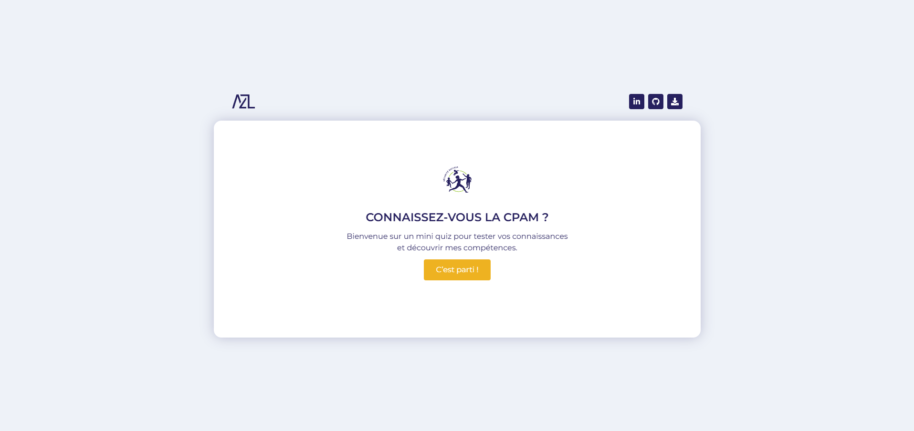

# 🧠 Quiz CPAM

Mini-application interactive de quiz sur l'Assurance Maladie, conçue avec React et Tailwind CSS.  
Ce projet a été réalisé pour accompagner une candidature en alternance à la CPAM du Val-d’Oise.

## 🎯 Objectif

Tester les connaissances de l'utilisateur sur la CPAM de manière ludique, tout en démontrant mes compétences techniques en :

- Conception d’interfaces (Atomic Design)
- Développement React avec TypeScript
- Gestion d’état et logique métier
- UX / UI responsive
- Animation et feedback dynamique

## 🚀 Stack technique

- ⚛️ React + Vite
- 💅 Tailwind CSS v4.1
- 🟦 TypeScript
- 🧬 Atomic Design (atoms / molecules / organisms / templates)

## 🖼️ Aperçu

## 🔍 Fonctionnalités

- Sélection d'une réponse par question
- Feedback visuel immédiat (bonne / mauvaise réponse)
- Mise en valeur de la bonne réponse si erreur
- Score final avec message personnalisé
- Composants typés et réutilisables
- Responsive mobile / desktop
- Animation fluide entre les questions

## 📁 Structure

src/
├─ components/
│ ├─ atoms/
│ ├─ molecules/
│ ├─ organisms/
│ └─ templates/
├─ data/ → questions du quiz
└─ App.tsx

## 🔗 Lien du projet

[Voir le quiz en ligne](https://azraelandres.github.io/quiz-cpam/)

## 👨🏿‍💻 Auteur

Azraël Landres - [LinkedIn](https://www.linkedin.com/in/azraellandres/)
